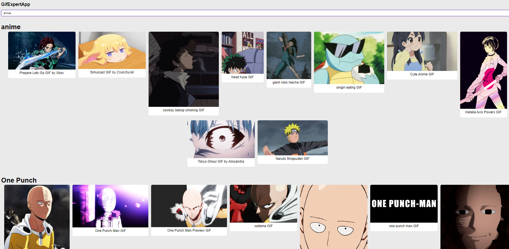

# Todo App for users RestAPI

[WITP](https://fass28.github.io/gifs/): React app created with Vite [Vite](https://vitejs.dev/) that consume [Giphy](https://api.giphy.com/v1/gifs) API


👉 https://fass28.github.io/gifs/

---



---
## Project setup
```markdown
# Install
npm install

# Compiles and hot-reloads for development
npm run dev

# Compiles and minifies for production
npm run build

# Preview production version
npm run preview

```

---